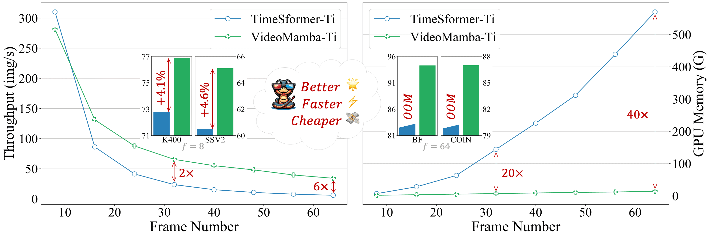

# :snake:VideoMamba

<div align="center">

<h2><a href="https://arxiv.org/abs/2403.06977">VideoMamba: State Space Model for Efficient Video Understanding</a></h2>

[Kunchang Li](https://scholar.google.com/citations?user=D4tLSbsAAAAJ), [Xinhao Li](https://leexinhao.github.io/), [Yi Wang](https://scholar.google.com.hk/citations?hl=zh-CN&user=Xm2M8UwAAAAJ), [Yinan He](https://scholar.google.com/citations?user=EgfF_CEAAAAJ), [Yali Wang](https://scholar.google.com/citations?user=hD948dkAAAAJ), [Limin Wang](https://scholar.google.com/citations?user=HEuN8PcAAAAJ) and [Yu Qiao](https://scholar.google.com/citations?user=gFtI-8QAAAAJ&hl)

</div>



## Update

- :fire: **2024/03/12**: **All the code and models are released.**
  - [image_sm](./videomamba/image_sm/README.md): Single-modality Image Tasks
    - Image Classification: [script](./videomamba/image_sm/README.md) & [model](./videomamba/image_sm/MODEL_ZOO.md)
  - [video_sm](./videomamba/video_sm/README.md): Single-modality Video Tasks
    - Short-term Video Understanding: [script](./videomamba/video_sm/README.md) & [model](./videomamba/video_sm/MODEL_ZOO.md)
    - Long-term Video Understanding: [script](./videomamba/video_sm/README.md) & [model](./videomamba/video_sm/MODEL_ZOO.md)
    - Masked Modeling: [script](./videomamba/video_sm/README.md), [model](./videomamba/video_sm/MODEL_ZOO.md)
  - [video_mm](./videomamba/video_mm/README.md): Multi-modality Video Tasks
    - Video-Text Retrieval: [script](./videomamba/video_sm/README.md) & [model](./videomamba/video_sm/MODEL_ZOO.md)


## Introduction


Addressing the dual challenges of local redundancy and global dependencies in video understanding, this work innovatively adapts the Mamba to the video domain. The proposed VideoMamba overcomes the limitations of existing 3D convolution neural networks and video transformers. Its linear-complexity operator enables efficient long-term modeling, which is crucial for high-resolution long video understanding. Extensive evaluations reveal VideoMamba's four core abilities: (1) Scalability in the visual domain without extensive dataset pretraining, thanks to a novel self-distillation technique; (2) Sensitivity for recognizing short-term actions even with fine-grained motion differences; (3) Superiority in long-term video understanding, showcasing significant advancements over traditional feature-based models; and (4) Compatibility with other modalities, demonstrating robustness in multi-modal contexts. Through these distinct advantages, VideoMamba sets a new benchmark for video understanding, offering a scalable and efficient solution for comprehensive video understanding. 


## Cite

If you find this repository useful, please use the following BibTeX entry for citation.

```latex
@misc{li2024videomamba,
      title={VideoMamba: State Space Model for Efficient Video Understanding}, 
      author={Kunchang Li and Xinhao Li and Yi Wang and Yinan He and Yali Wang and Limin Wang and Yu Qiao},
      year={2024},
      eprint={2403.06977},
      archivePrefix={arXiv},
      primaryClass={cs.CV}
}
```

## License

This project is released under the [Apache 2.0 license](./LICENSE)

## Acknowledgement

This repository is built based on [UniFormer](https://github.com/Sense-X/UniFormer), [Unmasked Teacher](https://github.com/OpenGVLab/unmasked_teacher) and [Vim](https://github.com/hustvl/Vim) repository.
